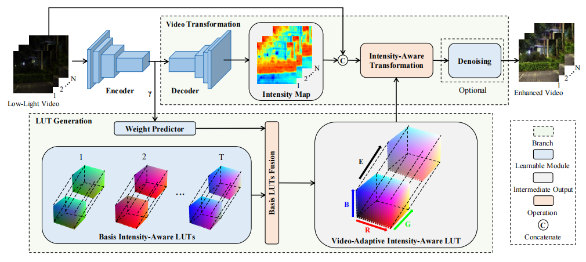

# FastLLVE

## Introduction

The codebase provides the official PyTorch implementation and some model checkpoints for the paper ["FastLLVE: Real-Time Low-Light Video Enhancement with
Intensity-Aware Lookup Table"](https://arxiv.org/abs/2308.06749) (accepted by ACM MM 2023).

<p align="center">
  
</p>

FastLLVE is an efficient pipeline which leverages the Look-Up-Table (LUT) technique to maintain inter-frame brightness consistency effectively. Specifically, we design a learnable Intensity-Aware LUT (IA-LUT) module for adaptive enhancement, which addresses the low-dynamic problem in low-light scenarios. This enables FastLLVE to perform low-latency and low-complexity enhancement operations while maintaining high-quality results. Experimental results on benchmark datasets demonstrate that our method achieves the state-of-the-art performance in terms of both image quality, inter-frame brightness consistency and efficiency.

## Prerequisites

### Dependencies

- Ubuntu 20.04.01
- Python 3.8.10
- PyTorch 1.8.1
- GCC/G++ 9.4.0
- CUDA 11.1

### Installation

The proposed IA-LUT Transform is implemented as a PyTorch CUDA extension. You need to install the extension in the following way:

```shell
python models/IALUT/IALUT_transform/setup.py install
```

In case you would like to remove the installed IA-LUT Transform extension, please execute the following command:

```shell
pip uninstall IALUT
```

## Datasets

### Download

The paper use the SDSD and SMID datasets from [Wang](https://github.com/dvlab-research/SDSD) for experiments. Note that the resolution of images is 512 x 960.

After unziping the datasets, please edit `./utils/prepare_SDSD` and `./utils/prepare_SMID` to modify paths to datasets and execute the following command to initialize datasets:

```
python utils/prepare_SDSD
python utils/prepare_SMID
```

## Usage

### Checkpoint

You can download our trained models from the [baidu pan (提取码：m9ub)](https://pan.baidu.com/s/1_sXYEQypI_W4OXn-I1zqkA) or the [google drive](https://drive.google.com/drive/folders/1AGgjfo6zriGJkZYLLBT6j55F4vNkdjWO?usp=sharing), then put them into `./pretrain`.

### Training

The training on indoor subset of SDSD:
```
python train.py -opt options/train/train_in_sdsd.yml
```

The training on outdoor subset of SDSD:
```
python train.py -opt options/train/train_out_sdsd.yml
```

The training on SMID:
```
python train.py -opt options/train/train_smid.yml
```

### Testing

Before starting the evaluation, you should write the location of checkpoint in "pretrain_model_G" of the corresponding YML file in `./options/test`.

The testing on indoor subset of SDSD:
```
python quantitative_test.py -opt options/test/test_in_sdsd.yml
python qualitative_test.py -opt options/test/test_in_sdsd.yml
```

The testing on outdoor subset of SDSD:
```
python quantitative_test.py -opt options/test/test_out_sdsd.yml
python qualitative_test.py -opt options/test/test_out_sdsd.yml
```

The testing on SMID:
```
python quantitative_test.py -opt options/test/test_smid.yml
python qualitative_test.py -opt options/test/test_smid.yml
```

## License

This codebase is released under the [Apache 2.0 license](LICENSE).

## Citation

If you find this repository useful, please kindly consider citing the following paper:
```
@InProceedings{li2023fastllve,
  title={FastLLVE: Real-Time Low-Light Video Enhancement with Intensity-Aware Lookup Table},
  author={Li, Wenhao and Wu, Guangyang and Wang, Wenyi and Ren, Peiran and Liu, Xiaohong},
  booktitle={Proceedings of the 31th ACM International Conference on Multimedia},
  year={2023}
}
```